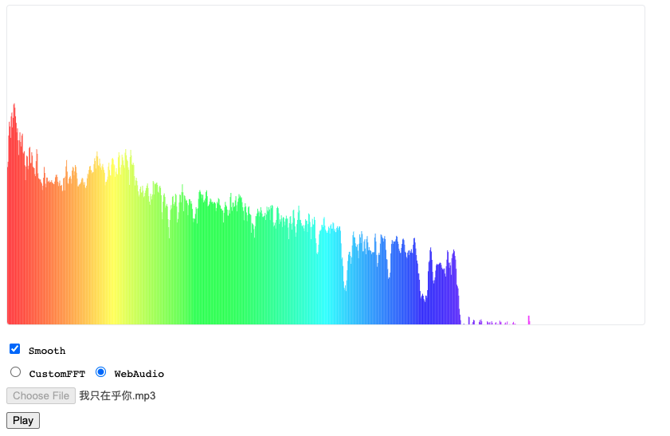

# Audio Visualization Demo

[Check this online.](http://cjting.me/audio-vis-demo/)

Have you ever wonder how these bars are generated? Why they seem to "dance" with the music?

For me, this seems pure magic. And actually, the science behind this, the Fourier transform, is even cooler.

In this demo, I implement the visualization without using any high-level api but step-by-step number crunchings.

The result is not that good but is's good enough. All the code is here [index.html](./index.html).
